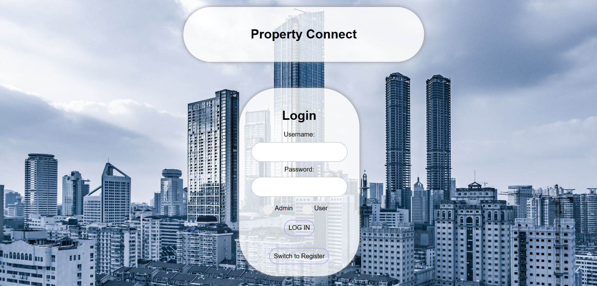
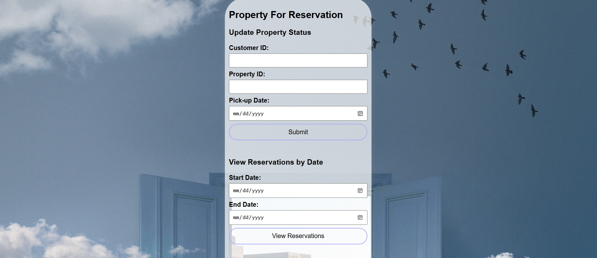
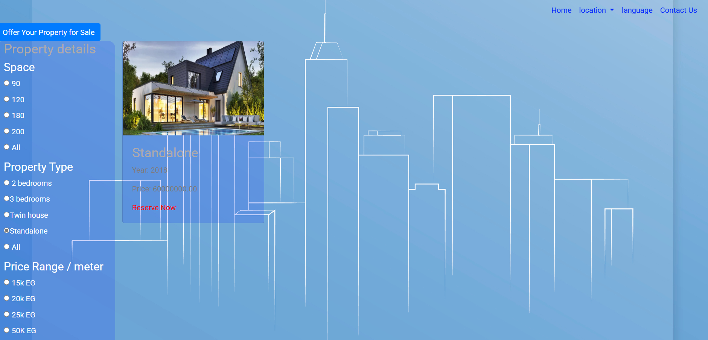

# 🏡 Property Connect Web Application

A web-based property rental and management system built using HTML, PHP, and CSS. The system enables users to register, log in, browse property listings, and make reservations. It also includes an admin panel for managing property data and reservations.

## ✨ Features

- User Registration and Authentication
- Property Browsing and Viewing
- Reservation System
- Admin Dashboard for Managing Listings and Reservations
- Simple and Responsive Design

## 📁 Project Structure

SW project/
├── admin.html # Admin login page
├── admin.php # Admin backend logic
├── car_data.php # Page for displaying property data
├── connect.php # MySQL connection script
├── home.html # Public landing page
├── login.html # User login form
├── login.php # Login backend logic
├── registration.html # User registration form
├── registration.php # Registration logic
├── rental.html # Main rental interface
├── view_reservation.php # View user reservations
├── rental.css # Main stylesheet
└── images/ # Image assets for properties and UI

markdown
Copy
Edit

## 🛠️ Technologies Used

- **Frontend:** HTML, CSS
- **Backend:** PHP
- **Database:** MySQL (assumed from `connect.php`)
- **Other:** Local image assets

## 🚀 Installation

1. **Clone or Download the Repository**
   ```bash
   git clone https://github.com/your-username/property-connect.git
Move the Folder to Your Web Server

Example for XAMPP:

C:\xampp\htdocs\SW project
Start Your Web Server

Launch Apache and MySQL via XAMPP or any other stack.

Create and Import the Database

Open phpMyAdmin

Create a new database (e.g., property_connect)

Import the database .sql file (if available)

If no SQL file is provided, you may need to manually create tables based on the logic in connect.php and *.php scripts.

Update connect.php

Ensure the database credentials match your local configuration.

▶️ Usage
Open a web browser and navigate to:

http://localhost/SW%20project/home.html
Users can register, log in, and browse available properties.

Admins can log in via admin.html to manage listings and reservations.

📸 Screenshots
](image.png)
](image-2.png)
](image-4.png)

🔐 Admin Functionality
Add/edit/remove property listings

View and manage reservations

User management (if applicable)

👨‍💻 Author
Nabeel Mohamed